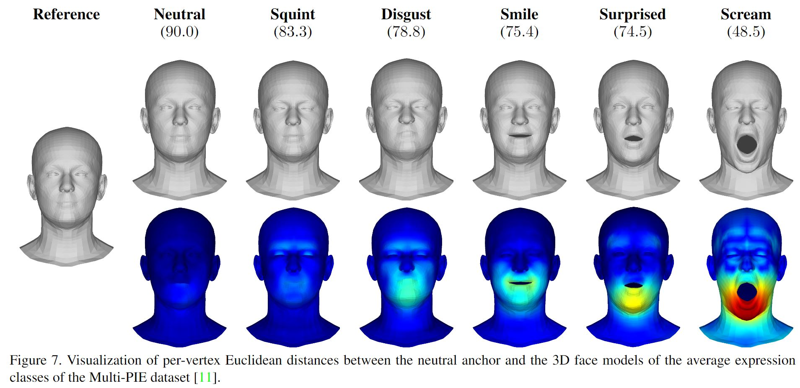

<!-- # NeutrEx -->
<h1 align="center"> NeutrEx: A 3D Quality Component Measure on Facial Expression Neutrality</h1>
<p align="center">

  <p align="center">
    <a href="https://www.ntnu.no/ansatte/marceg"><strong>Marcel Grimmer</strong></a>    
    ·
    <a href="https://dasec.h-da.de/staff/christian-rathgeb/"><strong>Christian Rathgeb</strong></a>
    ·
    <a href="https://people.utwente.nl/r.n.j.veldhuis"><strong>Raymond Veldhuis</strong></a>
    ·
    <a href="https://www.ntnu.edu/employees/christoph.busch"><strong>Christoph Busch</strong></a>

  </p>
  <h2 align="center">IJCB 2023</h2>
  <div align="center">
  </div>

  <!-- <a href="">
    
  </a> -->

This repository contains the official implementation of the [IJCB 2023](https://ijcb2023.ieee-biometrics.org/) paper [NeutrEx: A 3D Quality Component Measure on Facial Expression Neutrality](https://arxiv.org/abs/2308.09963). 


<p align="center"> 

</p>


EMOCA takes a single in-the-wild image as input and reconstructs a 3D face with sufficient facial expression detail to convey the emotional state of the input image. EMOCA advances the state-of-the-art monocular face reconstruction in-the-wild, putting emphasis on accurate capture of emotional content. The official project page is [here](https://emoca.is.tue.mpg.de/index.html).


## Installation 

Please follow the setup instructions of [EMOCA v2](https://github.com/radekd91/emoca) to create a conda environment ("work38"), download pre-trained models, and pull additional dependencies.     


## Usage 

Compute NeutrEx component quality values with the following script: 
```bash
python compute_neutrex_val.py --indir "/path/to/imageFolder" --anchor_dir "/path/to/neutral/anchor/multipie-neutral-ref-verts.npy"
```
According to our experiments, we provide two neutral anchors derived from two different datasets ("multipie-neutral-ref-verts.npy" and "feafa+-neutral-ref-verts.npy"). Running the above script will iterate over all images within the input folder, compute the NeutrEx values in correspondence to ISO/IEC CD2 29794-5, and store them in a CSV-file in the input folder directory.

## Citation 

If you use this work in your publication, please cite the following publications:

```
@inproceedings{NeutrEx:IJCB:2023,
  title = {{NeutrEx}: {A} 3D Quality Component Measure on Facial Expression Neutrality},
  author = {Grimmer, Marcel and Rathgeb, Christian, Veldhuis, Raymond and Busch, Christoph},
  journal = {arXiv preprint arXiv:2308.09963}
  year = {2023}
}
```
As our NeutrEx values are computed based on [EMOCA](https://github.com/radekd91/emoca) and [DECA](https://github.com/YadiraF/DECA), please further cite:
```
@inproceedings{EMOCA:CVPR:2021,
  title = {{EMOCA}: {E}motion Driven Monocular Face Capture and Animation},
  author = {Danecek, Radek and Black, Michael J. and Bolkart, Timo},
  booktitle = {Conference on Computer Vision and Pattern Recognition (CVPR)},
  pages = {20311--20322},
  year = {2022}
}
```
```
@article{DECA:Siggraph2021,
  title={Learning an Animatable Detailed {3D} Face Model from In-The-Wild Images},
  author={Feng, Yao and Feng, Haiwen and Black, Michael J. and Bolkart, Timo},
  journal = {ACM Transactions on Graphics (ToG), Proc. SIGGRAPH},
  volume = {40}, 
  number = {8}, 
  year = {2021}, 
  url = {https://doi.org/10.1145/3450626.3459936} 
}
```
## License
This code and model are **available for non-commercial scientific research purposes** as defined in the [LICENSE](https://emoca.is.tue.mpg.de/license.html) file. By downloading and using the code and model you agree to the terms of this license. 

## Acknowledgements  
To the authors of [DECA](https://github.com/YadiraF/DECA) and [EMOCA](https://github.com/radekd91/emoca), who made this work possible with their outstanding contributions.
